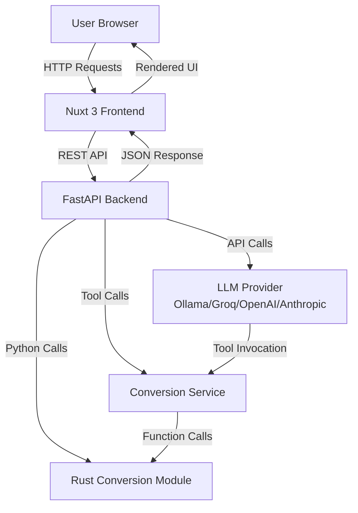
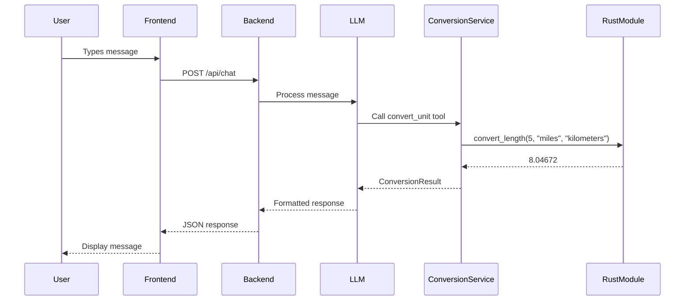
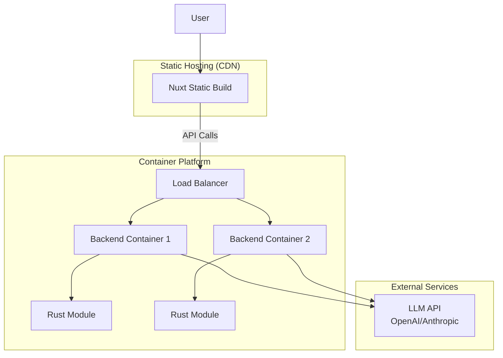

# Crazy Converterator Architecture

## Overview

Crazy Converterator is a web-based unit conversion application that uses natural language processing to understand user queries and perform accurate unit conversions. The system is built with a modern three-tier architecture: a Vue.js/Nuxt frontend, a FastAPI backend, and a high-performance Rust conversion library.

## System Architecture



## Component Overview

### Frontend Layer

**Technology**: Nuxt 3 (Vue.js framework)

**Location**: `frontend/`

**Key Components**:
- **ChatInterface.vue**: Main chat UI component that displays conversation history and handles user input
- **useChat.ts**: Composable that manages chat state and API communication
- **pages/index.vue**: Main application page

**Responsibilities**:
- Render the chat interface
- Handle user input and form submission
- Display conversation history
- Manage loading and error states
- Communicate with backend API

**Configuration**:
- API base URL configured in `nuxt.config.ts` (default: `http://localhost:8000`)
- Uses Tailwind CSS for styling
- Client-side rendering (SSR disabled)

### Backend Layer

**Technology**: FastAPI (Python web framework)

**Location**: `backend/`

**Key Components**:

#### API Routes (`app/api/routes.py`)
- **POST `/api/chat`**: Main chat endpoint that processes user messages
  - Accepts: `ChatRequest` with message and conversation history
  - Returns: `ChatResponse` with LLM response and updated conversation history
  - Handles error cases with appropriate HTTP status codes

#### LLM Service (`app/services/llm_service.py`)
- **Agent**: Pydantic AI agent with pluggable LLM providers
- **Supported Providers**:
  - **Ollama**: Free local models (qwen2.5-coder, deepseek-coder, codellama)
  - **Groq**: Free cloud API (llama-3.3-70b, mixtral)
  - **OpenAI**: Paid API (gpt-4o-mini, gpt-4o)
  - **Anthropic**: Paid API (claude-3-5-sonnet)
- **System Prompt**: Defines the assistant's role and capabilities
- **Tool Integration**: Registers conversion tools and MCP physics tools
- **Response Handling**: Processes LLM responses and extracts text

#### Conversion Service (`app/services/conversion_service.py`)
- **Tool Wrapper**: Wraps Rust conversion functions as Pydantic AI tools
- **Error Handling**: Gracefully handles missing Rust module
- **Tool Registration**: Exposes `convert_unit` tool to the LLM agent

#### MCP Physics Client (`app/mcp/physics_client.py`)
- **Placeholder**: Structure for future Physics MCP integration
- **Not Required**: For Phase 1, this is optional

**Configuration**:
- Environment variables in `.env`:
  - `LLM_PROVIDER`: "ollama", "groq", "openai", or "anthropic" (default: "ollama")
  - `LLM_MODEL`: Model name (default: "qwen2.5-coder:7b")
  - `OLLAMA_BASE_URL`: Ollama server URL (default: "http://localhost:11434/v1")
  - `GROQ_API_KEY`: Required for Groq provider
  - `OPENAI_API_KEY`: Required for OpenAI provider
  - `ANTHROPIC_API_KEY`: Required for Anthropic provider

### Rust Conversion Module

**Technology**: Rust with PyO3 bindings

**Location**: `rust/`

**Build System**: Maturin (Python-Rust integration)

**Structure**:
- **lib.rs**: Main module entry point, exports Python functions
- **conversions/**: Individual conversion modules for each category
  - `time.rs`, `length.rs`, `area.rs`, `volume.rs`, `mass.rs`
  - `speed.rs`, `acceleration.rs`, `force.rs`, `pressure.rs`
  - `energy.rs`, `power.rs`, `momentum.rs`, `torque.rs`
  - `temperature.rs`

**Conversion Pattern**:
Each conversion module follows a two-step process:
1. Convert from source unit to base unit (e.g., meters for length, seconds for time)
2. Convert from base unit to target unit

This approach allows conversion between any two units without needing conversion factors for every possible pair.

**Python Integration**:
- Built with `maturin develop` to create a Python extension module
- Imported as `converterator_rust` in Python
- Functions exposed: `convert_time`, `convert_length`, `convert_area`, etc.

## Data Flow

### Request Flow

1. **User Input**: User types a message in the chat interface
2. **Frontend**: `useChat` composable sends POST request to `/api/chat`
3. **Backend Route**: `routes.py` receives request and validates input
4. **LLM Service**: `llm_service.py` processes message with Pydantic AI agent
5. **Tool Invocation**: LLM identifies need for conversion and calls `convert_unit` tool
6. **Conversion Service**: `conversion_service.py` receives tool call
7. **Rust Module**: Rust function performs the actual conversion
8. **Response Chain**: Result flows back through service → LLM → route → frontend
9. **Display**: Frontend updates conversation history with response

### Response Flow



## Tool Integration Mechanism

### Pydantic AI Tools

The conversion functionality is exposed to the LLM through Pydantic AI's tool system:

1. **Tool Definition**: `convert_unit` function is decorated with `@tool`
2. **Type Hints**: Function parameters use Pydantic models and Literal types for validation
3. **Tool Registration**: Tools are added to the agent during initialization
4. **Automatic Invocation**: LLM decides when to call tools based on user queries
5. **Result Handling**: Tool results are returned to the LLM for response formatting

### Tool Signature

```python
@tool
def convert_unit(
    value: float,
    from_unit: str,
    to_unit: str,
    category: Literal["time", "length", "area", ...]
) -> ConversionResult
```

The LLM uses function calling to invoke this tool when it detects a conversion request.

## Deployment Architecture

For complete deployment instructions, see [deployment.md](deployment.md).

### Development Setup

1. **Rust Module**: Built locally with `maturin develop`
2. **Backend**: Runs on `localhost:8000` with `uvicorn main:app --reload`
3. **Frontend**: Runs on `localhost:3000` with `npm run dev`
4. **Environment**: Python virtual environment managed with `uv`

### Production Architecture



### Production Stack

| Component | Technology | Hosting Options |
|-----------|------------|-----------------|
| Frontend | Nuxt 3 (static) | Vercel, Netlify, CloudFlare Pages, nginx |
| Backend | FastAPI + Gunicorn | Docker on Render, Railway, Cloud Run, ECS |
| Rust Module | PyO3 wheel | Built into Docker image |
| LLM | OpenAI/Anthropic | External API |

### Key Production Considerations

- **ASGI Server**: Use Gunicorn with Uvicorn workers (not plain Uvicorn)
  ```bash
  gunicorn main:app -k uvicorn.workers.UvicornWorker -w 4
  ```
- **Docker**: Multi-stage build compiles Rust in builder stage, copies wheel to production stage
- **CORS**: Restrict origins to your frontend domain(s)
- **Secrets**: Use platform secret management (never commit API keys)
- **Health Checks**: `/health` endpoint monitors Rust module availability
- **Scaling**: Backend is stateless, scale horizontally as needed

## Dependencies

### Backend Dependencies
- `fastapi==0.115.0`: Web framework
- `uvicorn[standard]==0.32.0`: ASGI server
- `pydantic-ai==0.0.16`: LLM integration framework
- `python-dotenv==1.0.1`: Environment variable management
- `pydantic==2.9.2`: Data validation
- `pydantic-settings==2.5.2`: Settings management

### Frontend Dependencies
- `nuxt@^3.13.0`: Vue.js framework
- `@nuxtjs/tailwindcss@^6.12.1`: CSS framework integration
- `tailwindcss@^3.4.1`: Utility-first CSS

### Rust Dependencies
- `pyo3@0.22`: Python-Rust bindings (with extension-module feature)

### External Services
- **Ollama** (recommended): Local LLM inference - free, private, no API key required
- **Groq API**: Free cloud LLM inference with generous rate limits
- OpenAI API or Anthropic API: Paid LLM providers (optional)

## Technical Decisions

### PyO3 Version
- **Version**: 0.22
- **Rationale**: Updated to support Python 3.13 and latest features
- **Features**: Uses `extension-module` feature for Python extension module support

### Frontend Framework
- **Framework**: Nuxt.js 3
- **Rationale**: Modern, developer-friendly framework with excellent tooling
- **Styling**: Tailwind CSS for rapid UI development
- **Rendering**: Client-side rendering (SSR disabled for Phase 1)

### API Structure
- **Style**: RESTful API with single chat endpoint
- **Error Handling**: Graceful fallbacks when Rust module or MCP not available
- **Response Format**: JSON with conversation history maintained per request

## Error Handling

### Backend Error Handling
- **Import Errors**: Gracefully handles missing Rust module with clear error messages
- **Validation Errors**: Returns 400 status for invalid requests
- **LLM Errors**: Catches and logs LLM service failures
- **Tool Errors**: Propagates conversion errors with context

### Frontend Error Handling
- **Network Errors**: Detects connection failures and displays user-friendly messages
- **API Errors**: Handles different HTTP status codes appropriately
- **Error Display**: Shows errors in conversation history

### Health Check

The `/health` endpoint provides system status:
- Checks if Rust module is available
- Returns "healthy" or "degraded" status
- Includes component status information

## Security Considerations

- **CORS**: Currently allows all origins (should be restricted in production)
- **API Keys**: Stored in environment variables, never committed
- **Input Validation**: Pydantic models validate all API inputs
- **Error Messages**: Avoid exposing sensitive information in error responses

## Future Enhancements

- **MCP Physics Integration**: Connect to Physics MCP server for advanced calculations
- **Caching**: Cache common conversions for performance
- **Rate Limiting**: Implement rate limiting for API endpoints
- **Authentication**: Add user authentication if needed
- **Analytics**: Track conversion usage and popular queries
- **CI/CD Pipeline**: GitHub Actions workflow (see [deployment.md](deployment.md#cicd-pipeline))

## Related Documentation

- [SETUP.md](../SETUP.md) - Local development setup
- [deployment.md](deployment.md) - Production deployment guide
- [features.md](features.md) - Supported conversion types
- [plans/phase1_plan.md](plans/phase1_plan.md) - Implementation details

