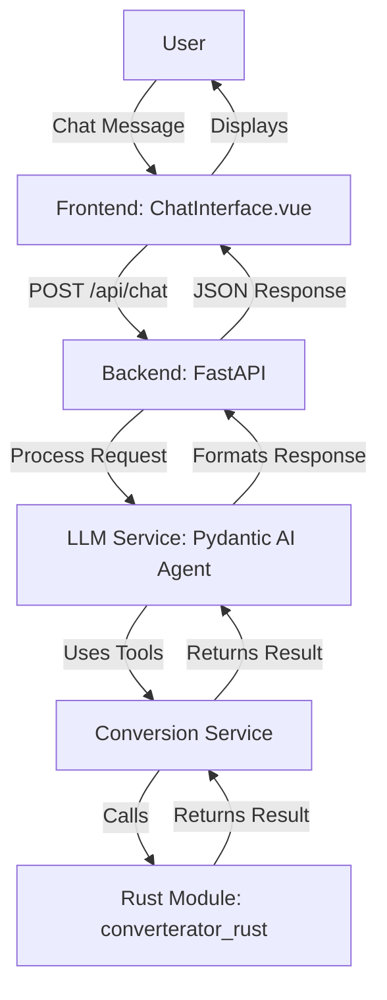

# Phase 1 Completion Plan

## Current Status Assessment

### Step 1: Rust Conversion Tool ✅ (Mostly Complete)
- **Status**: Rust conversion functions are implemented for 14 categories (time, length, area, volume, mass, speed, acceleration, force, pressure, energy, power, momentum, torque, temperature)
- **Python bindings**: PyO3 bindings are set up in [`rust/src/lib.rs`](rust/src/lib.rs)
- **Build configuration**: `pyproject.toml` and `Cargo.toml` are configured for maturin
- **Remaining**: Verify the module builds and is importable in Python

### Step 2: Chat Interface ✅ (Mostly Complete)
- **Backend**: FastAPI server exists in [`backend/main.py`](backend/main.py) with CORS configured
- **API Routes**: Chat endpoint exists in [`backend/app/api/routes.py`](backend/app/api/routes.py)
- **LLM Service**: Pydantic AI integration exists in [`backend/app/services/llm_service.py`](backend/app/services/llm_service.py)
- **Frontend**: Nuxt 3 app with ChatInterface component in [`frontend/components/ChatInterface.vue`](frontend/components/ChatInterface.vue)
- **Remaining**: Verify end-to-end integration works, add error handling improvements

### Step 3: Integration ✅ (Mostly Complete)
- **Conversion Service**: Wraps Rust functions as Pydantic AI tools in [`backend/app/services/conversion_service.py`](backend/app/services/conversion_service.py)
- **Tool Integration**: Conversion tools are included in the agent in [`backend/app/services/llm_service.py`](backend/app/services/llm_service.py)
- **Remaining**: Verify the tools are actually callable by the LLM and work correctly

## Implementation Tasks

### Task 1: Verify and Complete Rust Module Build
**Files**: [`rust/`](rust/), [`backend/app/services/conversion_service.py`](backend/app/services/conversion_service.py)

1. **Build the Rust module**
   - Run `maturin develop` in the `rust/` directory to build and install the Python extension
   - Verify the module can be imported: `python -c "import converterator_rust; print('OK')"`

2. **Test Rust conversions**
   - Create a simple test script to verify each conversion function works
   - Test at least one conversion from each category

3. **Handle import errors gracefully**
   - The current [`conversion_service.py`](backend/app/services/conversion_service.py) has a try/except for imports, but should provide clearer error messages
   - Consider adding a health check endpoint that verifies the Rust module is available

### Task 2: Complete Chat Interface Integration
**Files**: [`backend/app/api/routes.py`](backend/app/api/routes.py), [`backend/app/services/llm_service.py`](backend/app/services/llm_service.py), [`frontend/composables/useChat.ts`](frontend/composables/useChat.ts)

1. **Backend improvements**
   - Verify Pydantic AI agent initialization works correctly
   - Ensure conversation history is properly maintained across requests
   - Add better error handling and logging
   - Create a `.env.example` file in `backend/` if it doesn't exist

2. **Frontend improvements**
   - Verify API connection works (check `nuxt.config.ts` API base URL)
   - Test the chat interface sends/receives messages correctly
   - Ensure error states are displayed properly to users

3. **Integration testing**
   - Test a simple conversion query end-to-end
   - Verify the LLM can understand and respond to conversion requests

### Task 3: Verify Conversion Tool Integration
**Files**: [`backend/app/services/conversion_service.py`](backend/app/services/conversion_service.py), [`backend/app/services/llm_service.py`](backend/app/services/llm_service.py)

1. **Tool availability**
   - Verify the `convert_unit` tool is properly registered with the Pydantic AI agent
   - Test that the agent can call the tool with correct parameters

2. **Tool functionality**
   - Test that the LLM can identify when to use conversion tools
   - Verify tool calls return correct results
   - Ensure tool errors are handled gracefully

3. **End-to-end test**
   - Send a query like "Convert 5 miles to kilometers" through the chat interface
   - Verify the LLM uses the conversion tool and returns the correct answer

### Task 4: Documentation
**Files**: [`docs/architecture.md`](docs/architecture.md), [`docs/features.md`](docs/features.md)

1. **Architecture Document**
   - Document the overall system architecture
   - Include component diagrams showing how frontend, backend, Rust module, and LLM interact
   - Document data flow and request/response patterns
   - Explain the tool integration mechanism (Pydantic AI tools)
   - Document deployment architecture and dependencies

2. **Feature Document**
   - Document all supported conversion categories and units
   - List available features and capabilities
   - Include examples of supported queries
   - Document the chat interface functionality
   - Note any limitations or known issues

## Testing Checklist

- [ ] Rust module builds successfully with `maturin develop`
- [ ] Rust module can be imported in Python
- [ ] At least one conversion from each category works correctly
- [ ] Backend server starts without errors
- [ ] Frontend connects to backend API
- [ ] Chat interface sends messages successfully
- [ ] LLM responds to messages
- [ ] Conversion tools are available to the LLM
- [ ] LLM can use conversion tools correctly
- [ ] End-to-end conversion query works (e.g., "Convert 5 miles to kilometers")
- [ ] Architecture document is complete
- [ ] Feature document is complete

## Architecture Flow

## Dependencies

- Rust module must be built before backend can use it
- Backend must be running before frontend can connect
- LLM API key must be configured in `.env` file
- All Python dependencies must be installed (`pip install -r requirements.txt`)

## Notes

- The MCP physics client exists but is not required for Phase 1
- The current implementation has placeholder error handling that should be improved
- Consider adding logging for debugging tool calls and LLM interactions

