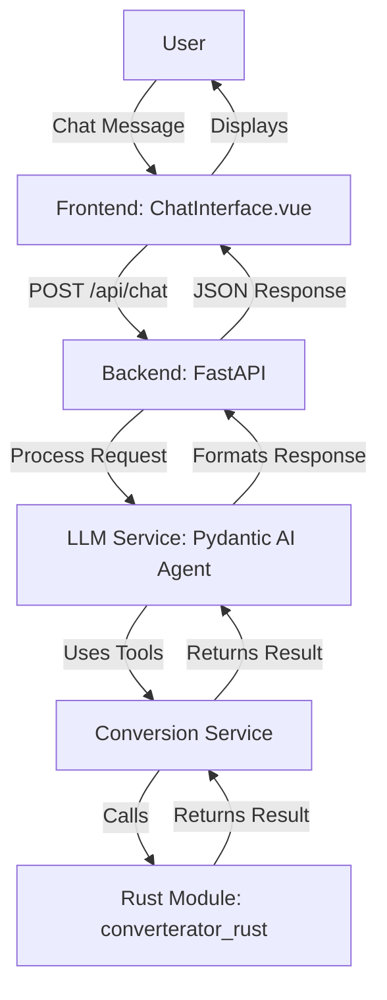

# Phase 1 Plan for Crazy Converterator

## Overview

This document consolidates the original Phase 1 Foundation Plan, Implementation Summary, and Completion Plan into a single comprehensive plan. It covers architecture decisions, implementation status, remaining tasks, and future considerations.

## Architecture Decisions

### 1. Project Structure

The project follows a modular structure that separates concerns:

```
crazy-converter/
├── docs/
│   ├── architecture.md
│   ├── features.md
│   └── plans/
│       └── phase1_plan.md (this file)
├── rust/
│   ├── Cargo.toml
│   ├── pyproject.toml (for maturin)
│   └── src/
│       ├── lib.rs (Python bindings)
│       └── conversions/
│           ├── mod.rs
│           ├── time.rs
│           ├── length.rs
│           ├── area.rs
│           ├── volume.rs
│           ├── mass.rs
│           ├── speed.rs
│           ├── acceleration.rs
│           ├── force.rs
│           ├── pressure.rs
│           ├── energy.rs
│           ├── power.rs
│           ├── momentum.rs
│           ├── torque.rs
│           └── temperature.rs
├── backend/
│   ├── main.py (FastAPI app)
│   ├── requirements.txt
│   ├── test_conversions.py
│   └── app/
│       ├── __init__.py
│       ├── api/
│       │   ├── __init__.py
│       │   └── routes.py (chat endpoints)
│       ├── services/
│       │   ├── __init__.py
│       │   ├── llm_service.py (Pydantic AI integration)
│       │   └── conversion_service.py (wrapper for Rust tools)
│       └── mcp/
│           ├── __init__.py
│           └── physics_client.py (Physics MCP integration)
├── frontend/
│   ├── nuxt.config.ts
│   ├── package.json
│   ├── app.vue
│   ├── app.html
│   ├── pages/
│   │   └── index.vue
│   ├── components/
│   │   └── ChatInterface.vue
│   ├── composables/
│   │   └── useChat.ts
│   └── assets/
│       └── css/
│           └── main.css
├── tests/
├── README.md
├── SETUP.md
└── .gitignore
```

**Rationale**:

- Separates Rust, Python backend, and frontend code
- Allows Rust crate to be built independently and imported as Python module
- MCP integration isolated in dedicated module
- Tests at multiple levels (unit + integration)

### 2. Rust-Python Integration: PyO3 + Maturin

**Approach**: Use PyO3 for Rust bindings and Maturin for building Python wheels.

**Why PyO3 + Maturin**:

- Industry standard for high-performance Rust-Python interop
- Maturin handles build automation and Python package generation
- Supports both development (`maturin develop`) and distribution (`maturin build`) workflows
- Minimal overhead for function calls

**Implementation**:

1. Rust library crate with PyO3 bindings
2. Conversion functions exposed via `#[pyfunction]` macros
3. Build Python extension module using `maturin develop` (dev) or `maturin build` (distribution)
4. Import in Python: `from converterator_rust import convert_length, convert_time, ...`

**Technical Decision**: PyO3 version 0.22 to support Python 3.13

### 3. Physics MCP Integration

**Status**: Structure ready, requires MCP server setup

**Rationale**:

- Provides Computer Algebra System (CAS) for symbolic math beyond basic unit conversions
- Natural language interface complements the conversational UX
- Advanced plotting capabilities for visualization (future Phase 2)
- Handles complex physics calculations that may be needed for energy/power conversions
- Complements Rust conversion tool (Rust for speed on simple conversions, MCP for complex math)

**Integration approach**:

- Use `mcp` Python client library to connect to Physics MCP server
- Wrap MCP tools as Pydantic AI tools alongside Rust conversion tools
- LLM can choose between Rust (fast, simple) and Physics MCP (complex, symbolic) tools

**Current Status**: Code structure complete with placeholder tools. Ready for MCP server connection once installed.

### 4. Frontend Framework: Nuxt.js

**Decision**: Use Nuxt.js 3 (Vue.js) for frontend framework

**Rationale**:

- Modern, developer-friendly framework with great DX
- Built-in SSR/SSG capabilities (using client-side rendering for Phase 1)
- Excellent tooling and ecosystem
- Vue's reactive system works well for chat interfaces
- Tailwind CSS for rapid UI development

## Implementation Status

### Step 1: Rust Conversion Tool ✅

**Status**: Completed

**What was built**:

- Rust library crate (`rust/`) with PyO3 bindings
- Conversion modules for 14 unit categories:
  - Time (seconds, minutes, hours, days, weeks, months, years)
  - Length (meters, feet, inches, yards, miles, kilometers, etc.)
  - Area (square meters, acres, hectares, etc.)
  - Volume (liters, gallons, cubic meters, etc.)
  - Mass (kilograms, pounds, grams, etc.)
  - Speed (m/s, mph, km/h, knots)
  - Acceleration (m/s², ft/s², g)
  - Force (newtons, pounds-force, etc.)
  - Pressure (pascals, PSI, bars, atmospheres, etc.)
  - Energy (joules, kWh, calories, BTUs, etc.)
  - Power (watts, kilowatts, horsepower, etc.)
  - Momentum (kg·m/s, lb·ft/s, etc.)
  - Torque (N·m, lb·ft, etc.)
  - Temperature (Celsius, Fahrenheit, Kelvin, Rankine)
- PyO3 module bindings in `src/lib.rs`
- `pyproject.toml` configured for maturin
- All code compiles successfully

**Remaining**: Build the module with `maturin develop` and verify it can be imported in Python

### Step 2: FastAPI + Pydantic AI Backend ✅

**Status**: Completed

**What was built**:

- FastAPI application structure
- API routes for chat endpoint (`/api/chat`)
- Pydantic AI agent integration with configurable LLM providers
- Support for both OpenAI and Anthropic models
- CORS middleware configured for frontend integration
- Health check endpoints (`/` and `/health`)
- Enhanced error handling and logging
- Environment variable configuration

**Files created**:

- `backend/main.py` - FastAPI application entry point with health check
- `backend/requirements.txt` - Python dependencies
- `backend/app/api/routes.py` - Chat API endpoints with improved error handling
- `backend/app/services/llm_service.py` - LLM agent service with logging

### Step 3: Connect Rust Tool to Pydantic AI ✅

**Status**: Completed

**What was built**:

- Conversion service wrapper (`conversion_service.py`)
- Pydantic AI tool registration using `@tool` decorator
- Unified `convert_unit` tool that routes to appropriate Rust functions
- Error handling and validation with `RUST_MODULE_AVAILABLE` flag
- Integration with LLM agent
- Graceful fallback when Rust module not available

**Files created**:

- `backend/app/services/conversion_service.py` - Conversion tool wrapper

**Remaining**: Verify tools are actually callable by the LLM and work correctly

### Step 4: Nuxt.js Web Interface ✅

**Status**: Completed

**What was built**:

- Nuxt.js 3 project with Tailwind CSS
- Chat interface component with message display
- API integration composable (`useChat`)
- Responsive UI with loading states
- Auto-scrolling message container
- Client-side rendering configuration
- Enhanced error handling for different error types

**Files created**:

- `frontend/pages/index.vue` - Main chat page
- `frontend/components/ChatInterface.vue` - Chat UI component
- `frontend/composables/useChat.ts` - API integration composable with improved error handling

**Remaining**: Verify end-to-end integration works

### Step 5: Physics MCP Integration ✅

**Status**: Structure complete, requires MCP server setup

**What was built**:

- Physics MCP client structure
- Placeholder tools for symbolic math operations:
  - `solve_equation` - Solve equations symbolically
  - `evaluate_expression` - Evaluate mathematical expressions
  - `simplify_expression` - Simplify expressions using CAS
- Integration with LLM agent
- Error handling for when MCP is not configured

**Files created**:

- `backend/app/mcp/physics_client.py` - Physics MCP client and tools

**Remaining**: Install and configure Physics MCP server

## Remaining Tasks

### Task 1: Verify and Complete Rust Module Build

1. **Build the Rust module**

   - Run `maturin develop` in the `rust/` directory to build and install the Python extension
   - Verify the module can be imported: `python -c "import converterator_rust; print('OK')"`

2. **Test Rust conversions**
   - Use `backend/test_conversions.py` script to verify each conversion function works
   - Test at least one conversion from each category

### Task 2: Complete Chat Interface Integration

1. **Backend verification**

   - Verify Pydantic AI agent initialization works correctly
   - Ensure conversation history is properly maintained across requests
   - Test API endpoints

2. **Frontend verification**

   - Verify API connection works (check `nuxt.config.ts` API base URL)
   - Test the chat interface sends/receives messages correctly
   - Ensure error states are displayed properly to users

3. **Integration testing**
   - Test a simple conversion query end-to-end
   - Verify the LLM can understand and respond to conversion requests

### Task 3: Verify Conversion Tool Integration

1. **Tool availability**

   - Verify the `convert_unit` tool is properly registered with the Pydantic AI agent
   - Test that the agent can call the tool with correct parameters

2. **Tool functionality**

   - Test that the LLM can identify when to use conversion tools
   - Verify tool calls return correct results
   - Ensure tool errors are handled gracefully

3. **End-to-end test**
   - Send a query like "Convert 5 miles to kilometers" through the chat interface
   - Verify the LLM uses the conversion tool and returns the correct answer

### Task 4: Documentation ✅

**Status**: Completed

- Architecture document created in `docs/architecture.md`
- Features document created in `docs/features.md`
- SETUP.md updated with environment variable examples and test instructions

## Testing Checklist

- [ ] Rust module builds successfully with `maturin develop`
- [ ] Rust module can be imported in Python
- [ ] At least one conversion from each category works correctly (use `test_conversions.py`)
- [ ] Backend server starts without errors
- [ ] Frontend connects to backend API
- [ ] Chat interface sends messages successfully
- [ ] LLM responds to messages
- [ ] Conversion tools are available to the LLM
- [ ] LLM can use conversion tools correctly
- [ ] End-to-end conversion query works (e.g., "Convert 5 miles to kilometers")
- [ ] Health check endpoint reports correct status

## Success Criteria for Phase 1

- [x] Rust conversion tool created with all unit categories (14 categories)
- [x] FastAPI backend with Pydantic AI integration
- [x] Rust tools connected to Pydantic AI
- [x] Nuxt.js web interface created
- [x] Physics MCP integration structure ready
- [x] Error handling improvements completed
- [x] Health check endpoint added
- [x] Documentation created (architecture and features)
- [ ] User can ask "Convert 5 miles to kilometers" via web interface (pending testing)
- [ ] LLM calls Rust conversion tool correctly (pending testing)
- [ ] Response includes accurate conversion result (pending testing)
- [ ] All basic unit categories work (pending testing)
- [ ] FastAPI server runs reliably (pending testing)
- [ ] Frontend displays conversation clearly (pending testing)

## Dependencies

### Backend Dependencies

- fastapi==0.115.0
- uvicorn[standard]==0.32.0
- pydantic-ai==0.0.16
- python-dotenv==1.0.1
- pydantic==2.9.2
- pydantic-settings==2.5.2

### Frontend Dependencies

- nuxt@^3.13.0
- @nuxtjs/tailwindcss@^6.12.1
- tailwindcss@^3.4.1

### Rust Dependencies

- pyo3@0.22 (with extension-module feature)

### External Services

- OpenAI API or Anthropic API for LLM functionality

## Known Limitations

1. **Physics MCP**: Structure is ready but requires MCP server installation and configuration
2. **Conversation History**: Currently handled per-request; could be enhanced with session management
3. **Streaming**: Not yet implemented; responses are returned all at once
4. **Rust Module**: Must be built manually with `maturin develop` before use
5. **Error Messages**: Basic error handling in place; could be more user-friendly in some cases

## Future Enhancements (Post-Phase 1)

### Command-Line Interface

**Recommendation**: Use Typer for CLI implementation

**Implementation approach**:

- Create `backend/app/cli/` module with CLI commands
- Reuse same services (LLM service, conversion service) from web API
- Use Rich for formatted output (progress bars, tables, syntax highlighting)
- Command structure: `converterator chat "Convert 5 miles to kilometers"`

### CI/CD Pipeline

**Decision**: Use GitHub Actions with container-based deployment

**Recommended Approach**: Traditional container-based deployment

**Architecture**:

- Build Docker container with Rust + Python dependencies
- Push to container registry (GitHub Container Registry, Docker Hub, or cloud provider registry)
- Deploy container to cloud service (Cloud Run, ECS, App Service, Railway, Render)

**GitHub Actions Workflow**:

1. **CI Phase** (on every PR/push):

   - Install Rust toolchain, build Rust crate
   - Test Rust code (cargo test)
   - Install Python dependencies, test Python code
   - Build Rust-Python extension using maturin
   - Run integration tests
   - Lint and format checks

2. **CD Phase** (on merge to main):
   - Build multi-stage Docker image:
     - Stage 1: Build Rust extension
     - Stage 2: Python runtime + dependencies + built extension
   - Push to container registry
   - Deploy to cloud provider (using OIDC for authentication)
   - Optionally deploy Nuxt.js frontend separately (static hosting or SSR)

**Cloud Provider Options**:

1. **Railway/Render** (Simplest): Automatic deployments from GitHub, built-in container registry
2. **Google Cloud Run**: Serverless container platform, automatic scaling
3. **AWS (ECS/Fargate)**: Use GitHub Actions with OIDC, push to ECR
4. **Azure Container Instances or App Service**: Similar to GCP Cloud Run

## Architecture Flow



## Next Steps

1. **Build Rust Module**:

   ```bash
   cd rust
   pip install maturin
   maturin develop
   ```

2. **Set Up Backend**:

   ```bash
   cd backend
   pip install -r requirements.txt
   # Create .env file with API keys (see SETUP.md)
   uvicorn main:app --reload --port 8000
   ```

3. **Set Up Frontend**:

   ```bash
   cd frontend
   npm install
   npm run dev
   ```

4. **Test End-to-End**:

   - Open browser to `http://localhost:3000`
   - Ask: "Convert 5 miles to kilometers"
   - Verify LLM calls conversion tool and returns result

5. **Run Test Script**:
   ```bash
   cd backend
   python test_conversions.py
   ```

## Notes

- All code compiles and passes linting checks
- Project structure follows the plan
- Ready for Phase 1 testing once dependencies are installed and API keys are configured
- Physics MCP integration can be completed when MCP server is set up
- CLI interface is planned for a future phase
- CI/CD pipeline is planned for a future phase
